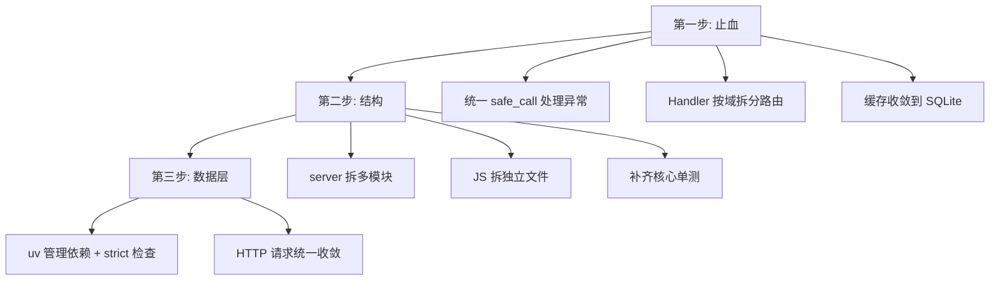

# 基金监控项目架构评审

> 日期：2026-08-11
> 视角：高级程序架构师
> 范围：源码结构、数据层、并发模型、异常处理、测试与工程化

---

## 一、总体评价

**定位**：单机个人工具型应用。当前架构（进程 + 文件缓存 + 轮询）对"个人自用、单机运行"是**够用且务实的**——没有过度设计。但存在一批**技术债务**，随着功能增多（推荐、监控、估算误差、多窗口评分、docker/systemd 部署），债主逐步显现，最近几轮排查（首屏慢、差异徽章丢失）已暴露代价。

**核心矛盾**：一个 7400+ 行、40 个 API 的"个人工具"，承担了超出其架构承载的复杂度。

## 二、规模现状

| 模块 | 行数 | 备注 |
|---|---|---|
| fund_server.py | 2823 | Handler 类占 2160 行（644-2805），40 个 API 内联 |
| fund_recommend.py | 1252 | 推荐主流程 |
| fund_utils.py | 1006 | 核心工具/缓存/网络 |
| fund_watch.py | 698 | 数据获取/评分 |
| fund_monitor.py | 649 | 盘中监控 |
| fund_render.py | 481 | 表格渲染 |
| fund_scoring.py | 311 | 评分维度 |
| fund_manage.html | 3825 | 前端单文件：100 函数 / 61 fetch / 80 内联事件 |

## 三、高优先级问题（P0 - 影响正确性与可维护性）

### 1. 巨型单文件：`fund_server.py` 2823 行、`Handler` 2160 行、40 个 API 内联

**问题**：
- 每个 API 的完整逻辑（数据获取 + 业务 + 渲染 + 缓存 + 错误处理）挤在一个 `if parsed.path == ...` 块里
- 无法单独测试、复用、替换任何 API
- 改动一个 API 要理解 2000 行上下文

**建议**：按域拆分路由处理器（推荐/自选/监控/误差/配置/任务），`Handler` 只做路由分发。

### 2. 异常吞噬：121 处 `except`、96 处 `pass`

```python
try:
    ...
except Exception:
    pass          # 96 处！错误完全静默
```

**问题**：这是最近所有 bug 排查困难的总根源——settle 网络风暴、徽章丢失、首屏慢，全都是因为异常被吞，日志看不到真实原因。

**建议**：抽一个 `safe_call(name, fn, fallback)` 工具，统一"记录 + 降级"；关键路径用 `log.warning(exc_info=True)`。

### 3. `fund_trend_cache.json` 达 **111MB**（6332 只 × 平均 758 点）

**问题**：
- 每次进程内加载要读 111MB JSON → 冷启动慢的直接原因之一
- 同一路径还有 111MB 的 `.tmp` 文件（原子写残留），合计 220MB
- 未来持续膨胀（每只基金 3 年 760 点 × 全市场）

**建议**：改用 **SQLite**（单文件、索引、按基金查询、增量更新）或拆分分片。

## 四、中优先级问题（P1 - 影响效率与一致性）

### 4. 数据一致性问题：多个缓存各写各的

`fund_trend_cache` / `fund_holdings_cache` / `fund_td_cache` / `fund_rank_cache` / `fund_est_error` —— **6 个独立 JSON 缓存，无统一事务/失效机制**。最近排查的"差异徽章缺失"、"td 口径不一致"都源于此。

**建议**：缓存层收敛为一个带统一 TTL / 失效 / 版本控制的存储抽象。

### 5. 多进程各自持有全局状态 + 锁（12 处模块级可变状态）

server / recommend / monitor **三个进程**共享同一批磁盘缓存，各自进程内又有内存副本 + mtime 检测 + 锁。跨进程一致性靠"文件 mtime"猜测，脆弱。

**建议**：明确**单一写者**（谁负责写哪个缓存），或用 SQLite 的 WAL 让跨进程读写安全。

### 6. `fund_manage.html` 3825 行单文件，100 个函数、61 处 fetch、80 处内联事件

**问题**：无法复用、无法测试、XSS 风险（大量 `innerHTML` 拼接服务器返回的 HTML）、回调地狱。

**建议**：至少把 **JS 拆出独立文件**；长期可考虑轻量框架或组件化。

## 五、低优先级问题（P2 - 锦上添花）

| 项 | 现状 | 建议 |
|---|---|---|
| 测试覆盖 | 84 个测试 / 7400 行，核心网络/缓存路径几乎无测 | 至少给 settle/backfill/缓存 TTL 逻辑补单测（用 mock，不打真网络） |
| 配置/依赖管理 | 无 requirements.txt 锁定，mypy `strict=false` | `uv` 管理依赖；关键模块开 `strict` |
| HTTP 请求分散 | 22 处硬编码 `urlopen` 绕过统一 `fetch`（无限速/重试/缓存） | 统一收敛到 `fund_utils.fetch`，避免域名限速 bug 重演 |
| print 日志 | 104 处 `print` 在生产路径 | 已部分转 log，剩余逐步迁移 |
| 推荐结果文件 | `.fund_recommend_result.json` 10MB 单文件 | 可拆分为"元数据 + 明细"或压缩 |

## 六、架构演进建议（长期）

按"风险/收益"排序，分三步走，**不要一次性大重构**（个人工具，重构成本高、收益不确定）：



- **第一步（止血，1-2 天）**：异常处理 + 路由拆分 + SQLite 化缓存 —— 解决"排查难"和"数据层隐患"
- **第二步（结构，2-3 天）**：server 拆模块、前端 JS 外置、补单测
- **第三步（工程化）**：依赖管理、类型检查、请求收敛

## 七、结论

这个项目的**功能设计**（估算误差、多窗口评分、缓存分层、推荐增量模式）相当出色，但**工程形态**还停留在"脚本集合"阶段。最值得投入的是 **P0 的三项**：

1. **异常吞噬**（96 处 `pass`）—— 最近所有排查难的根源，改造成本极低
2. **`fund_server.py` 巨型 handler** —— 40 个 API 内联，拆分后维护性质变
3. **111MB JSON 缓存** —— 冷启动慢 + 无限膨胀，SQLite 化后根治
